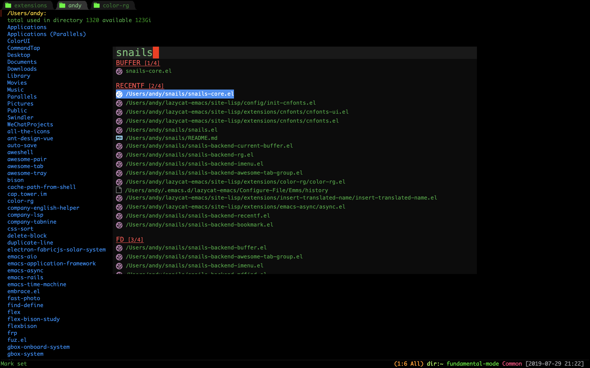
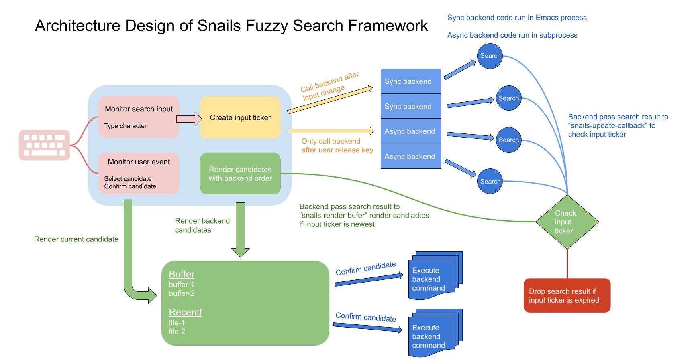

# What is snails?
Snails is a modern, easy-to-expand fuzzy search framework.

The goal of this project is to minimize the development threshold for fuzzy search plugins.
If you know how to write a filter function, you can write a new search plugin in 5 minutes,
regardless of how complex the search framework is.

## Installation
1. Clone or download this repository (path of the folder is the `<path-to-snails>` used below).
2. If you are using Mac, install [exec-path-from-shell](https://github.com/purcell/exec-path-from-shell) dependency.
3. In your `~/.emacs`, add the following two lines:
```elisp
(add-to-list 'load-path "<path-to-snails>") ; add snails to your load-path
(require 'snails)
```

## Usage
```M-x snails``` to launch snails

* Default snails search input in backends: awesome-tab group, buffer name, recently files or bookmark
* Search command if prefix start with >
* Search variable or function define if prefix start with @
* Search current buffer content if prefix start with #
* Search project file content if prefix start with !
* Search file if prefix start with ?
* Enter "!color-rg@/Users/andy/color-rg" to search ```color-rg``` keywrod in directory ```/Users/andy/color-rg``` recursively.
* Enter "?color-rg@" to search ```color-rg``` file in HOME directory.
* Enter "?color-rg@/home/andy/color-rg" to search ```color-rg``` file in ```/home/andy/color-rg``` directory.

You can use ```M-x snails-search-point``` to launch snails with symbol around point.



You can customize ```snails-default-backends``` and ```snails-prefix-backends``` with your own prefix rule.

### Use Snails With Custom Backends
You can also customize the search backends you want to use! (similar to [Ivy](https://github.com/abo-abo/swiper#ivy))

You can either write your own backend (see below) or assemble all available backends like the following:

#### Just search opened buffers (use snails with 1 backend only!)
```elisp
(snails '(snails-backend-buffer))
```

#### Search opened buffers and recently opened files (use snails with 2 backends!)
```elisp
(snails '(snails-backend-buffer snails-backend-recentf))
```

#### Search symbol at point of opened buffers and recently opened files (use snails with 2 backends!)
```elisp
(snails '(snails-backend-buffer snails-backend-recentf) t)
```

#### Search customize string ```hello```
```elisp
(snails nil "hello")
```

When you customize the search backends, snails won't filter search result with input prefix.

## Currently Available Backends

| Backend                          | Description                                                                                                                  |
| :--------                        | :----                                                                                                                        |
| snails-backend-awesome-tab-group | Switch group of awesome-tab, need install plugin ```awesome-tab```                                                           |
| snails-backend-buffer            | Search buffer list                                                                                                           |
| snails-backend-recentf           | Search recently files                                                                                                        |
| snails-backend-bookmark          | Switch bookmark                                                                                                              |
| snails-backend-imenu             | Jump to function or variable definition                                                                                      |
| snails-backend-current-buffer    | Search current buffer content                                                                                                |
| snails-backend-rg                | Use ripgrep search content in current project, need install ```ripgrep```                                                    |
| snails-backend-projectile        | Search files in current project, need install plugin ```projectitle```                                                       |
| snails-backend-fd                | Use fd search files in current project, need install ```fd```                                                                |
| snails-backend-mdfind            | Use mdfind search files in local disk, only Mac                                                                              |
| snails-backend-everything        | Use everything search files in local disk, only Windows, need install ```everything```                                       |
| snails-backend-command           | Search command                                                                                                               |
| snails-backend-eaf-pdf-table     | Search table of contents of PDF file, united [EAF](https://github.com/manateelazycat/emacs-application-framework) technology |

## Fuzz match
Snails use normal match algorithm default.

Snails will use fuzz match algorithm once you install [fuz](https://github.com/cireu/fuz.el) and add fuz in load-path.

To install fuz.el , please follow below steps:
1. Install [Rust](https://rustup.rs/)
2. Download fuz.el repo: git clone https://github.com/cireu/fuz.el
3. Build fuz-core.so: ```cargo build --release```
4. Rename ```target/release/libfuz_core.so``` or ```target/release/libfuz_core.dylib``` to ```fuz-core.so```
5. Make sure ```fuz-core.so``` and all files in https://github.com/cireu/fuz.el add to your ```load-path```

## Keymap

| Key         | Description               |
| :--------:  | :----                     |
| C-n         | Select next candidate     |
| C-p         | Select previous candidate |
| M-n         | Select next candidate     |
| M-p         | Select previous candidate |
| C-v         | Select next backend       |
| M-v         | Select previous backend   |
| M-j         | Select next backend       |
| M-k         | Select previous backend   |
| C-m         | Confirm candiate          |
| RET         | Confirm candiate          |
| M-w         | Copy candidate            |
| C-g         | Quit snails               |
| ESC ESC ESC | Quit snails               |
| M-h         | Quit snails               |

## Architecture Design of Snails



snails-core.el is framework code, it only do:
1. Monitor user input, generate input ticker and send a search request to the backend.
2. Check backend's search result with input ticker.
3. Render search result if input ticker is newest.

Sync backend search action is trigger by framework when user type new character.
Async backend search action only trigger by framework when user release keyboard key.

Input ticker is the label of the input event，backend's input ticker will expired when user type new character in input buffer.

When backend search finish, framework will drop search result if input ticker is expired.

## How to Write a New Plugin?

Writing a plugin for snails is very simple.
As long as you have basic knowledge of elisp, you can write a plugin in 5 minutes!

Snails plugins fall into two categories: sync plugins and asynchronous plugins.

Sync plugins are plugins that get the completion results immediately, such as buffers, recent files, etc.

Asynchronous plugins are plugins that take time to get completion results and are usually placed in child processes for calculation, such as find file, grep file, etc.

### Writing a Sync Plugin
Let's take the example of ```snails-backend-recentf``` plugin:

```elisp
(require 'snails-core)
(require 'recentf)

(recentf-mode 1)

(snails-create-sync-backend
 :name
 "RECENTF"

 :candidate-filter
 (lambda (input)
   (let (candidates)
     (dolist (file recentf-list)
       (when (or
              (string-equal input "")
              (string-match-p (regexp-quote input) file))
         (snails-add-candiate 'candidates (snails-wrap-file-icon file) file)))
     candidates))

 :candiate-do
 (lambda (candidate)
   (find-file candidate)))

(provide 'snails-backend-recentf)
```

* :name parameter is the name of your plugin, and it must be unique. Snails distinguishes the results of different plugins based on the plugin name.

* :candidate-filter is the filter function. ```input``` is user input content, and you need to return a candidate list to the snails framework, where elements of the candidate list are formatted as ```(list display-name candidate-content)```. The first candidate element ```display-name``` is the string presented to the user, and the second candidate element ```candidate-content``` is the string passed to the ```candidate-do``` callback below. If nothing was found, please return nil, and snails will hide the backend result.

* :candidate-do is the function to confirm the candidate, and it can be any code you want.

Taking the above plug-in as an example, when the user does not input anything, all the recently viewed files are displayed, and when the user does input something, the recently viewed files are filtered according to the input content. When the user confirms, use the find-file command to open the file.

### Writing an Async Plugin
Let's take the example of ```snails-backend-mdfind``` plugin:

```elisp
(require 'snails-core)

(snails-create-async-backend
 :name
 "MDFIND"

 :build-command
 (lambda (input)
   (when (and (featurep 'cocoa)
              (> (length input) 5))
     (list "mdfind" (format "'%s'" input))))

 :candidate-filter
 (lambda (candidate-list)
   (let (candidates)
     (dolist (candidate candidate-list)
       (snails-add-candiate 'candidates (snails-wrap-file-icon candidate) candidate))
     candidates))

 :candiate-do
 (lambda (candidate)
   (find-file candidate)))

(provide 'snails-backend-mdfind)
```

* :name parameter is the name of your plugin, and it must be unique. Snails distinguishes the results of different plugins based on the plugin name.

* :build-command is the function to build a command with user input. ```input``` is the user input content, and you need to  return a list of strings where the first string is a shell command, and the rest of the strings are arguments to pass to the shell command. If you don't want the search to continue, please return nil.

* :candidate-filter is the filter function, ```candidate-list``` is a list of strings returned by the shell command, and you need to return a candidate list to the snails framework, where elements of the candidate list are formatted as ```(list display-name candidate-content)```. The first candidate element ```display-name``` is the string presented to the user, and the second candidate element ```candidate-content``` is the string passed to the ```candidate-do``` callback below. If nothing was found, please return nil, and snails will hide the backend result.

* :candidate-do is the function to confirm the candiate, and it can be any code you want.

Taking the above plug-in as an example, when the user inputs "multi-term", build-command will check the input length, and the search will only start after more than 5 characters have been entered. Then, the build-command function will build commands ```(list "mdfind" "'multi-term'")``` to pass to the async subprocess. When the async subprocess finishes, it will return a list of strings to the candidate-fitler callback, and the candiate-filter function will wrap the shell result as a candidate list. When the user confirms, use the find-file command to open the file.

Snails is very smart; it will manage subprocesses of the async backend. When the user modifies the input, the snails framework automatically creates a new subprocess to search for the results, while automatically killing the old running process. No matter how fast the user enters, it won't block Emacs.

## FAQ

### Why doesn't snails frame work when I open a fullscreen Emacs on Mac?
Mac will force the fullscreen Emacs window to a separate workspace, and then any new frame created by ```make-frame``` will not float above the Emacs window as expected.

If you start Emacs with fullscreen mode, you can use my workaround code to fix this problem:

```elisp
(if (featurep 'cocoa)
    (progn
      (setq ns-use-native-fullscreen nil)
      (setq ns-use-fullscreen-animation nil)

      (set-frame-parameter (selected-frame) 'fullscreen 'maximized)

      (run-at-time "2sec" nil
                   (lambda ()
                     (toggle-frame-fullscreen)
                     )))
  (require 'fullscreen)
  (fullscreen))
```

### Why not support match highlight?
Search tools such as fd and rg has --color option.
It's easy use `ansi-color' library to render match color.

But the reason why Snails doesn't show highlights is because rendering colors can cause very large performance problems, causing Emacs to get stuck.

The biggest goal of Snails project is fast, although I know that highlighting is very meaningful, so I am willing to sacrifice this feature for fluency.

If you know how to keep fluency when adding highlights, please contribute your patch. ;)

### Manage Evil state
I personally never use the evil plugin, if you want manage evil state in input buffer of snails.
You should customize your own code with `snails-mode-hook'
